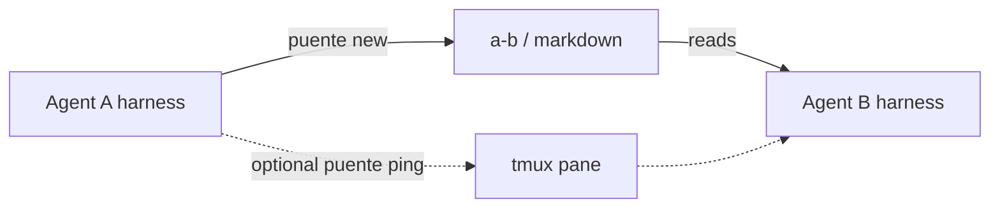

# agente-puente

**Each AI stays in its own harness.** They collaborate through markdown files — not by driving another vendor’s CLI or API as a third-party client.

[](LICENSE)

> ES: Un puente de ficheros entre agentes (Claude Code, Grok Build, Gemini, Codex…). Cada uno en su arnés y ToS; el texto es la fuente de verdad.

## Why

Multi-agent setups often break ToS or become fragile when one agent scripts another’s interactive CLI. **agente-puente** keeps the pattern boring and durable:

1. Write a markdown message into the recipient’s inbox
2. Optionally send a one-line tmux ping (“read this file”)
3. Archive when done



## Install

```bash
git clone https://github.com/bettycrypto77-dev/agente-puente.git
cd agente-puente
make install   # copies bin/puente to ~/.local/bin
```

Requires bash. `puente ping` needs `tmux`.

## Quickstart

```bash
puente init ~/agente-puente
puente new alice bob hello <<'MD'
Hola — cuando puedas, revisa este mensaje.
MD
puente inbox bob
puente ping bob 'Lee a-bob/ y responde con puente new'
puente done <id-or-path>
```

Configure agents in `puente.toml` (see `puente.toml.example`).

## Commands

| Command | What it does |
|---------|----------------|
| `puente init [dir]` | Create inboxes + example config |
| `puente new <from> <to> <slug>` | Write message (stdin body) |
| `puente inbox [agent]` | List pending files |
| `puente done <id\|file>` | Move to `hecho/` |
| `puente ping <agent> "…"` | tmux nudge by process name |
| `puente watch` | Poll inboxes |
| `puente agents` | List configured agents |

Protocol details: [docs/PROTOCOLO.md](docs/PROTOCOLO.md).

## Related

- [Grok Build](https://github.com/xai-org/grok-build) — OSS coding agent TUI (`grok`)
- Claude Code / other harnesses — stay in their own panes; talk via this bridge

## Contributing

See [CONTRIBUTING.md](CONTRIBUTING.md). Issues and PRs welcome — ⭐ if this pattern helps your desk.

## License

MIT
